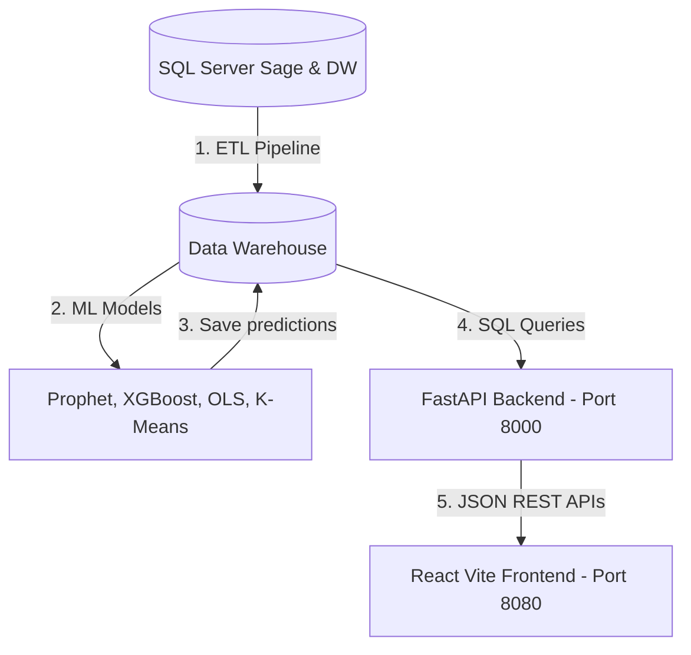

# FinMAG Analytics: Guide d'Exécution & Démarrage

Ce guide détaille les étapes pour orchestrer et lancer l'ensemble de la plateforme FinMAG : l'**ETL**, les **Modèles de Machine Learning**, le **Serveur Backend (FastAPI)**, et le **Dashboard Frontend (Vite/React)**.

---

## 🚀 Résumé Express : Démarrage Rapide

Pour lancer le backend et le frontend en parallèle avec les bonnes variables d'environnement, ouvrez deux terminaux PowerShell distincts dans le dossier principal :

### 📡 1. Lancer l'API Backend (FastAPI)
Ouvrez un terminal dans `FINMAG/dashboard/backend` et exécutez :
```powershell
$env:PYTHONPATH="c:\Users\marie\Desktop\myProject\FINMAG;c:\Users\marie\Desktop\myProject\FINMAG\dashboard\backend"
python -m uvicorn api.queries:app --host 127.0.0.1 --port 8000 --reload
```

### 💻 2. Lancer le Dashboard Frontend (Vite React)
Ouvrez un terminal dans `FINMAG/dashboard/frontend` et exécutez :
```powershell
npm install
npm run dev
```
L'application sera alors accessible sur **[http://localhost:8080](http://localhost:8080)** (ou le port alternatif indiqué dans la console).

---

## 🛠️ Guide Détaillé de l'Architecture



### 📦 Étape 1 : Le Pipeline de Données (ETL)
Le pipeline extrait les écritures comptables, les factures et les articles depuis Sage, les transforme en dimensions et en faits, puis alimente le Data Warehouse.
- **Répertoire de travail :** `FINMAG/`
- **Commande d'exécution complète :**
  ```powershell
  $env:PYTHONPATH="c:\Users\marie\Desktop\myProject\FINMAG"
  python -m etl.pipeline --full
  ```

---

### 🧠 Étape 2 : L'Entraînement des Modèles Machine Learning
Les scripts ML entraînent les modèles prédictifs et enregistrent leurs résultats dans le DW :
1. **Prophet (KPI-05) :** Prévisions de chiffre d'affaires.
2. **Payment XGBoost (KPI-11) :** Probabilités de recouvrement de créances.
3. **Safety Stock (KPI-17) :** Buffers statistiques de volatilité ($CV$).
4. **OLS Rupture (KPI-18) :** Régression linéaire sur la consommation d'inventaire.
5. **K-Means RFM (KPI-22) :** Segmentation non supervisée des clients.

- **Répertoire de travail :** `FINMAG/dashboard/backend`
- **Exécuter la totalité des modèles :**
  ```powershell
  $env:PYTHONPATH="c:\Users\marie\Desktop\myProject\FINMAG"
  python -m ml.runner
  ```
- **Exécuter uniquement le modèle K-Means RFM :**
  ```powershell
  $env:PYTHONPATH="c:\Users\marie\Desktop\myProject\FINMAG"
  python -m ml.kpi22_rfm_kmeans
  ```

---

### 📡 Étape 3 : Le Serveur FastAPI (Backend)
L'API expose les endpoints pour le dashboard, en s'interfaçant avec le DW et les modèles de prédictions enregistrés.
- **Répertoire de travail :** `FINMAG/dashboard/backend`
- **Commande d'exécution :**
  ```powershell
  $env:PYTHONPATH="c:\Users\marie\Desktop\myProject\FINMAG;c:\Users\marie\Desktop\myProject\FINMAG\dashboard\backend"
  python -m uvicorn api.queries:app --host 127.0.0.1 --port 8000 --reload
  ```
- **Endpoints clés exposés :**
  - `/api/ml/forecast-ca` : Prévisions temporelles de vente (Prophet) avec intervalle de confiance.
  - `/api/ml/forecast-tresorerie` : Trésorerie multi-couche (Déterministe, Statistique, XGBoost).
  - `/api/ml/produits-alerts` : Cockpit de restockage dynamique (Safety Stock & Rupture OLS).
  - `/api/ml/rfm-segments` : Segmentation client IA et indice de Silhouette.

---

### 💻 Étape 4 : L'Interface Utilisateur React/Vite (Frontend)
Le frontend récupère les données analytiques et prédictives pour les afficher de manière interactive avec des visualisations premium.
- **Répertoire de travail :** `FINMAG/dashboard/frontend`
- **Commandes d'exécution :**
  ```powershell
  npm install
  npm run dev
  ```

---

## 🛡️ Résolution des Problèmes Courants (Troubleshooting)

### 🔴 Erreur `ModuleNotFoundError: No module named 'etl'`
* **Cause :** Python ne trouve pas le package racine.
* **Correction :** Assurez-vous d'avoir configuré `$env:PYTHONPATH` dans votre terminal actuel comme indiqué ci-dessus.

### 🔴 Erreur `Port 8080 is already in use`
* **Cause :** Un autre serveur de développement (ou instance de subagent) tourne sur le port `8080`.
* **Correction :** Vous pouvez libérer le port en tuant le processus en cours, ou laisser Vite choisir automatiquement le port disponible suivant (ex: `8081`).

### 🔴 Erreur `Cannot connect to database`
* **Cause :** La chaîne de connexion dans le fichier `.env` est invalide ou le VPN SQL Server est déconnecté.
* **Correction :** Vérifiez le fichier `.env` situé dans `FINMAG/dashboard/backend/.env` et assurez-vous que `DW_ENGINE` est bien configuré.
